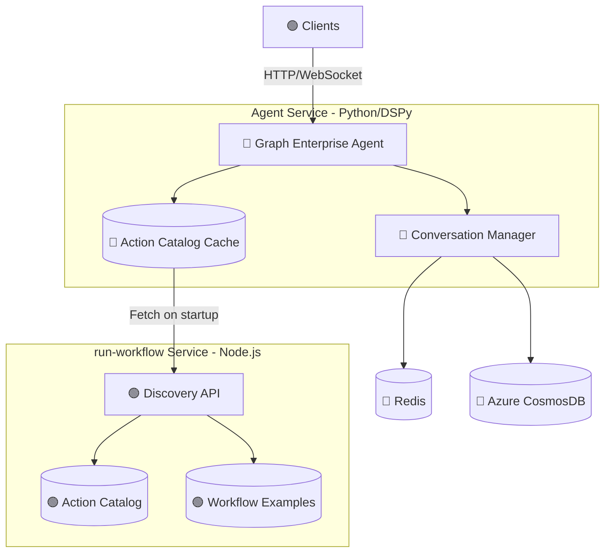
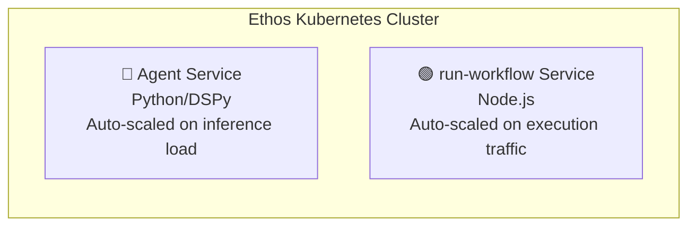

# Graph Enterprise Agent - Architecture Design

## Overview

The **Graph Enterprise Agent** is an AI-powered service that generates workflow graphs from natural language descriptions. Users describe what they want to accomplish, and the agent produces a structured workflow graph composed of connected nodes that can be executed on the run-workflow service.

This document outlines the high-level architecture, key design decisions, and deployment strategy.

---

## System Architecture



**Legend:** 🟢 Existing (already built) · 🔵 To Build (new components)

---

## Core Components

### 1. Graph Enterprise Agent (DSPy Framework)

The agent is built on the **DSPy framework**, chosen for its capabilities in building reliable AI systems.

#### Why DSPy?

| Capability | Description |
|------------|-------------|
| **Prompt Modularization** | DSPy uses declarative signatures to define inputs and outputs. This separates the "what" from the "how," making prompts maintainable and reusable across different LLM providers. |
| **Validation** | The framework validates that LLM outputs conform to expected schemas before returning results. Malformed responses are caught and handled gracefully. |
| **Self-Correction** | Using the ReAct (Reasoning + Acting) pattern, the agent can observe execution results, identify errors, and iteratively correct its output until the workflow is valid. |

#### How It Works

1. User submits a natural language request
2. Agent retrieves available actions from its local cache (synced from run-workflow)
3. Agent generates workflow using ReAct reasoning with catalog and examples as context
4. Agent validates the graph structure
5. If errors are found, agent self-corrects and retries
6. Valid workflow graph is returned to the client

---

### 2. Discovery API (Action Catalog)

The Discovery API lives in the **run-workflow service** and provides the agent with information about available workflow actions.

| Aspect | Description |
|--------|-------------|
| **Purpose** | Provide action definitions and example workflows to the agent |
| **Location** | run-workflow service (source of truth for what actions exist) |
| **Endpoints** | `GET /actions/catalog`, `GET /actions/examples` |
| **Consumers** | Agent Service (via startup sync and periodic refresh) |

---

### 3. Why Action Catalog Over Full Schema?

The agent consumes action definitions to generate workflows. We chose a compact catalog format with curated examples over full JSON Schema descriptors for two reasons:

1. **LLMs learn from examples, not schemas** - Language models are trained on natural language and code patterns. They generate more accurate output when shown examples of correct workflows than when given formal schema definitions to reason about.

2. **Token efficiency** - A compact catalog describing 50 actions fits within context limits (~2,500 tokens). Full JSON Schema descriptors for the same actions would exceed practical limits (~25,000 tokens), leaving no room for conversation history or reasoning.

The catalog tells the agent what actions exist; the examples show how to wire them together correctly.

---

### 4. Action Catalog Format

The catalog uses a compact, LLM-optimized format. Each action is described concisely with its purpose, inputs, outputs, and key parameters.

#### Example: remove-background Action

**Catalog Entry:**

```
remove-background
  Description: Removes background from images using AI, outputs PNG with transparency
  Inputs: input-images (image, required)
  Outputs: outputs (image)
  Parameters:
    - mode: 'cutout' | 'replace', default 'cutout'
    - backgroundColor: hex color like '#FFFFFF', only when mode='replace'
    - trim: boolean, crop to content bounds, default false
```

**Example Workflow:**

```json
{
  "userRequest": "Remove background from my product photos",
  "workflow": {
    "metadata": {
      "workflowId": "remove-bg-example",
      "name": "Remove Background"
    },
    "actions": [
      {
        "actionId": "input-1",
        "actionType": "input-images",
        "parameters": {
          "images": [
            { "name": "product.jpg", "sourceUrl": "{{USER_IMAGE}}", "storageType": "external" }
          ]
        },
        "outputPorts": [{ "name": "outputs", "mimeTypes": ["image/jpeg", "image/png"] }]
      },
      {
        "actionId": "remove-bg-1",
        "actionType": "remove-background",
        "parameters": {},
        "inputPorts": [{ "name": "input-images", "mimeTypes": ["image/jpeg", "image/png"], "required": true }],
        "outputPorts": [{ "name": "outputs", "mimeTypes": ["image/png"] }]
      }
    ],
    "connections": [
      {
        "connectionSource": "input-1",
        "sourcePort": "outputs",
        "connectionTarget": "remove-bg-1",
        "targetPort": "input-images"
      }
    ]
  }
}
```

---

### 5. Conversation Management

The Agent Service manages chat history directly, eliminating the need for a separate chat history service.

| Aspect | Description |
|--------|-------------|
| **Ownership** | Agent Service manages all conversation state |
| **Hot Storage** | Recent turns cached in Redis for fast context retrieval |
| **Cold Storage** | Full history persisted to Azure CosmosDB |
| **Rationale** | Every conversation passes through the agent anyway; embedding chat management reduces latency and simplifies the architecture |

Each conversation record includes:
- User and assistant messages
- Timestamps
- Graph state snapshots (tracking how the workflow evolved)
- Session metadata

---

## Agent API Design

The Agent API supports both HTTP and WebSocket protocols to accommodate different client needs.

### HTTP Endpoint

```
POST /chat
```

**Request:**
- User message/instructions
- Session identifier
- Optional: Existing workflow to modify

**Response:**
- Workflow graph (JSON)
- Status message
- Success indicator

### WebSocket Support

For real-time, streaming interactions:

```
WS /chat/stream
```

Clients connect via WebSocket to receive:
- Incremental progress updates
- Reasoning steps as they occur
- Final workflow graph on completion

---

## Deployment Strategy

The system is deployed as **two separate services** to support independent scaling based on usage patterns.



### Action Catalog Caching

The Agent Service maintains a local cache of action definitions:

| Event | Action |
|-------|--------|
| Service startup | Fetch catalog and examples from run-workflow, populate Redis cache |
| Periodic refresh | Background sync every N minutes to pick up new/updated actions |
| Cache miss | Graceful degradation using last known definitions |

---

## Data Storage

### Database: Azure CosmosDB

Azure CosmosDB stores conversation history for the agent.

| Requirement | CosmosDB Fit |
|-------------|--------------|
| **Append-heavy writes** | Messages added incrementally as users chat |
| **Flexible schema** | Graph state snapshots, evolving metadata per message |
| **Embedded documents** | Store graph state within each message naturally |
| **Azure integration** | Native VNET integration, Azure AD, unified billing |

### Data Containers

| Container | Purpose |
|-----------|---------|
| **conversations** | Chat sessions with embedded messages and graph state history |

Note: Action definitions are not stored in the database. They live in the run-workflow codebase and are served via the Discovery API.

---

## Technology Stack

| Component | Technology |
|-----------|------------|
| **Agent Service** | Python, DSPy, FastAPI |
| **run-workflow Service** | Node.js, Azure Durable Functions |
| **Agent Cache** | Redis (managed) |
| **Database** | Azure CosmosDB |
| **Container Orchestration** | Kubernetes (Ethos) |

---

## Summary

The Graph Enterprise Agent architecture prioritizes:

- **Reliability** through DSPy's validation and self-correction capabilities
- **Simplicity** through a two-service architecture with clear responsibilities
- **Effectiveness** through action catalog and examples optimized for LLM consumption
- **Scalability** through separate service deployments based on workload characteristics
- **Responsiveness** through WebSocket streaming and Redis caching

